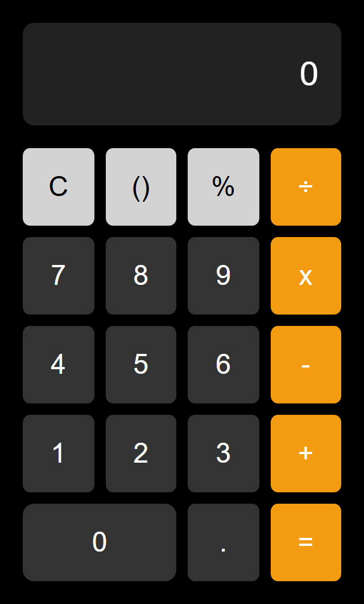

<p align="right">
  <a href="#user-content--descrição">Leia em Português</a>
</p>

# JavaScript Calculator



## 📝 Description

This is a simple and functional web calculator project, built with fundamental web technologies: HTML, CSS, and JavaScript. The goal was to create a clean, intuitive, and responsive interface inspired by modern smartphone calculators, featuring an eye-pleasing dark theme.

## ✨ Features

- **Basic operations:** Addition (+), Subtraction (-), Multiplication (x), and Division (÷).
- **Percentage calculation** (%).
- **'C' button** to clear the display.
- **Support for decimal numbers** (.).
- **Responsive interface** that adapts to different screen sizes.
- **Modern design** with a dark theme.

## 🚀 Technologies Used

This project was built using the following technologies:


## 📂 How to Use

No complex installation is required. To view and use the calculator, follow the steps below:

1.  **Clone the repository:**

    ```sh
    git clone https://github.com/buenohy/javascript-calculator.git
    ```

2.  **Navigate to the project folder:**

    ```sh
    cd javascript-calculator
    ```

3.  **Open the `index.html` file** in your preferred browser.

And that's it! The calculator will be ready to use.

## 📁 Project Structure

```
/
├── index.html # Main file with the calculator's structure
├── styles.css # Stylesheet for design and layout
└── script.js # JavaScript code with all the logic and functionality
```

## 👨‍💻 Author

Made with ❤️ by Gabriel Bueno Hygino.

## ⚖️ License

This project is licensed under the MIT License. See the [LICENSE](LICENSE) file for more details.

---

<p align="right">
  <a href="#javascript-calculator">Read in English</a>
</p>

# Calculadora em JavaScript


## 📝 Descrição

Este é um projeto de uma calculadora web simples e funcional, desenvolvida com tecnologias web básicas: HTML, CSS e JavaScript. O objetivo foi criar uma interface limpa, intuitiva e responsiva, inspirada em calculadoras modernas de smartphones, com um tema escuro agradável aos olhos.

## ✨ Funcionalidades

- Operações básicas: Adição (+), Subtração (-), Multiplicação (x) e Divisão (÷).
- Cálculo de porcentagem (%).
- Botão 'C' para limpar o display (Clear).
- Suporte para números decimais (.).
- Interface responsiva que se adapta a diferentes tamanhos de tela.
- Design moderno com um tema escuro.

## 🚀 Tecnologias Utilizadas

O projeto foi construído utilizando as seguintes tecnologias:


## 📂 Como Usar

Não é necessário nenhuma instalação complexa. Para visualizar e usar a calculadora, siga os passos abaixo:

1.  **Clone o repositório:**

    ```sh
    git clone https://github.com/buenohy/javascript-calculator.git
    ```

2.  **Navegue até a pasta do projeto:**

    ```sh
    cd javascript-calculator
    ```

3.  **Abra o arquivo `index.html`** no seu navegador de preferência.

E pronto! A calculadora estará pronta para uso.

## 📁 Estrutura do Projeto

```
/
├── index.html # Arquivo principal com a estrutura da calculadora
├── styles.css # Folha de estilos para o design e layout
└── script.js # Código JavaScript com toda a lógica e funcionalidades
```

## 👨‍💻 Autor

Feito com ❤️ por Gabriel Bueno Hygino.

## ⚖️ Licença

Este projeto está sob a licença MIT. Veja o arquivo [LICENSE](LICENSE) para mais detalhes.
